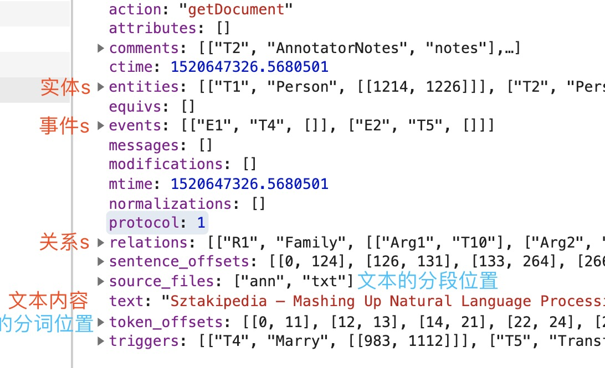

# NOT DONE!!! 未完成！！！
## 基于[brat](https://github.com/nlplab/brat)的标注工具

将brat工具vue化，但：

 - 没有实现Event\triggers和Note

 - 搜索仅文档内，没有实现文集列表搜索

 - 数据（Data）框只实现了导出功能（对比Compare、自动标注Automatic annotation和导入Import功能没有实现）

[] 多行标签


## 数据结构及实现逻辑

### 最主要的两个接口：


主要获取关于目录的配置，比如实体的背景、字体颜色，关系的颜色、起止节点类别，目录的表头(header)和列表内容(items)



获取文档所有信息，包括文档内容（无分段纯文本），文本分段、分词位置，文档中的实体和关系等。

### 前端逻辑

1. 根据text和sentence_offsets拿到分段后的文本信息 => ```分段信息```
2. 根据entities拿到所有实体上的文本，并根据位置排序 => ```排序实体```
3. 计算每行对象: 文字、行高、行宽、top位置、行上的实体们：实体、位置、宽高```[{ eleTxt, w, h, y, entities: [{entity, x,y,width,height}] }]``` => ```行数据```
    3.1 根据sentence_offsets计算eleTxt, w, h, y
    3.2 计算此行内的实体，处理实体重叠问题
    3.3 矫正行高
    3.4 矫正svg宽高
4. 计算每行关系：根据relations和```行数据```画出实体间的线